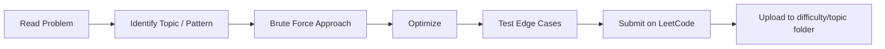

<div align="center">

# 🧠 LeetCode Problem Solving
### Abdullah Al Shovon

*A difficulty-and-topic organized archive of the problem I solve on LeetCode*


</div>


## About

This repository is my personal log of the problem I solve on LeetCode.


## Repository Structure

```
leetcode-problem-solving/
├── easy/
│   ├── array/
│   ├── two pointer/
│   ├── binary search/
│   ├── hash table/
│   ├── string/
│   └── math/
├── medium/
│   ├── two pointer/
│   ├── binary search/
│   ├── sliding window/
│   ├── graph/
│   ├── dynamic programming/
│   └── math/
└── hard/
    ├── dynamic programming/
    ├── segment tree/
    ├── graph/
    └── math/
        
```

> Folder names mirror the topic tags LeetCode assigns to each problem, written lowercase with spaces (not hyphens) — matching how the four examples above are actually filed.

---


## Naming Convention

```
<difficulty>/<topic>/<problem-number> <Problem Title>.cpp
```

Example: `medium/two pointer/3867 Sum of GCD of Formed Pairs.cpp`

- **Difficulty** — exactly as LeetCode labels it: `easy`, `medium`, or `hard`.
- **Topic** — the primary tag I'm drilling. If a problem spans several tags, it goes under the one I most want practice in.
- **Filename** — `<problem number> <Title>.cpp`, spaces kept as-is for readability.

---

## My Problem-Solving Workflow



---

## Tech Stack


---

## Achievements

- 🥋 **Knight** level (most recent badge, 13 badges earned total)
- 🏆 Contest rating **1889**, ranked **41,810 / 875,878** globally
- 📈 Top **4.91%** of all contest participants
- 🔥 **142-day** max streak, **308** active days, **1,044** submissions in the past year


---

## Connect

- 💼 LinkedIn: [linkedin.com/in/shoovoon](https://linkedin.com/in/shoovoon)

---

## License

This repository is licensed under the [MIT License](LICENSE) — feel free to fork it for your own practice log.
